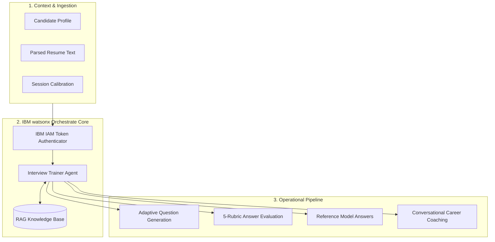
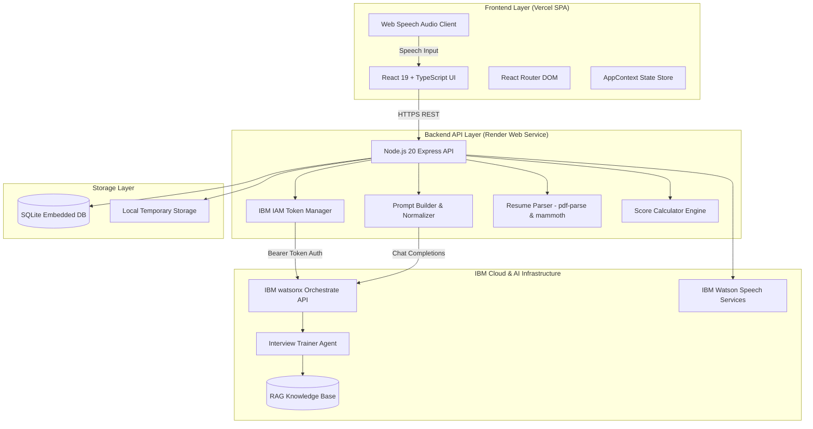

<div align="center">

# 🎯 AI Interview Trainer

### *Personalized AI-Powered Mock Interviews & Real-Time Career Coaching*

[](https://www.ibm.com/products/watsonx-orchestrate)
[](https://ai-interview-trainer-eight.vercel.app/)
[](https://ai-interview-trainer-backend-5s3m.onrender.com)
[](https://www.typescriptlang.org/)
[](https://react.dev/)
[](https://nodejs.org/)
[](https://tailwindcss.com/)
[](LICENSE)

<p align="center">
  <b>An enterprise-grade interview preparation platform combining candidate context, automated resume parsing, RAG-grounded knowledge, and an autonomous AI agent configured in IBM watsonx Orchestrate.</b>
</p>

---

[🌐 Live Application](https://ai-interview-trainer-eight.vercel.app/) •
[🎥 Video Demo](#-live-deployed-video-demonstration) •
[✨ Key Features](#-key-features) •
[🏗️ Architecture](#-system-architecture) •
[🤖 IBM Agent](#-ibm-watsonx-orchestrate-agent) •
[📊 Scoring Rubric](#-answer-evaluation--scoring-rubric) •
[⚡ Quick Start](#-getting-started--local-setup) •
[📡 API Reference](#-rest-api-reference)

---

</div>

<br/>

## 🌟 Executive Summary

Preparing for modern technical, behavioral, and HR interviews is often disjointed: static question banks provide zero feedback, generic LLM prompts lack resume awareness, and human coaching is expensive and inaccessible.

**AI Interview Trainer** solves this by providing an end-to-end, personalized mock interview environment powered by an **Interview Trainer Agent** configured in **IBM watsonx Orchestrate**. Candidates practice real-time, one-question-at-a-time simulations tailored specifically to their **resume, target role, experience level, and target company**, receiving instant multi-rubric evaluation, strength/growth breakdowns, and expert model answers.

---

## 💎 Core Technology Foundation

| Technology Layer | Implementation & Role |
| :--- | :--- |
| **🤖 AI Agent** | **IBM watsonx Orchestrate** — Powers autonomous question generation, answer evaluation, and coaching |
| **📚 Knowledge Layer** | **RAG-based Interview Knowledge Base** — Curated domain rubrics (Tech, HR, STAR, SQL, Python) |
| **☁️ Cloud Platform** | **IBM Cloud** — Hosts the watsonx Orchestrate service and IAM security pipeline |
| **💻 Frontend SPA** | **React 19 · TypeScript · Vite · Tailwind CSS 4** — Deployed globally on **Vercel** |
| **⚙️ Backend API** | **Node.js 20 · Express 4 · TypeScript · SQLite** — Deployed with persistent runtime on **Render** |
| **🎙️ Voice Engine** | **Dual-Tier Audio Pipeline** — IBM Watson Speech (STT/TTS) with native Web Speech API fallback |
| **🛠️ Development** | **IBM Bob** — AI-assisted development workflow and rapid iteration environment |

---

## 🥊 Traditional Preparation vs. AI Interview Trainer

| Feature | Static Question Banks (LeetCode/Glassdoor) | Generic AI Prompts (ChatGPT) | 🎯 AI Interview Trainer |
| :--- | :---: | :---: | :---: |
| **Resume & Profile Awareness** | ❌ No | ⚠️ Manual Copy-Paste | ✅ **Automated PDF/DOCX Parsing & Synced Context** |
| **Real-Time Granular Scoring** | ❌ No | ⚠️ Vague/Inconsistent | ✅ **Standardized 5-Dimension Weighted Rubric** |
| **One-Question Interactive Pacing**| ❌ No | ⚠️ Walls of Text | ✅ **Simulated Live Interview Arena with Timer** |
| **RAG Knowledge Grounding** | ❌ No | ⚠️ Generic Heuristics | ✅ **Grounded in Enterprise Interview Rubrics** |
| **Voice / Speech Practice** | ❌ No | ❌ No | ✅ **Full Speech-to-Text & Text-to-Speech Flow** |
| **Comprehensive Dossier & Export** | ❌ No | ❌ No | ✅ **Detailed Readiness Verdict & Report Dossier** |

---

## 🎬 Live Deployed Video Demonstration

Watch the complete live walkthrough and demonstration of the deployed **AI Interview Trainer** system running on **Vercel** (Frontend) and **Render** (Backend):

<div align="center">
  <a href="docs/videos/deployed-system-demo.mp4">
    
  </a>

  <br/><br/>
  
  > 🎥 **[Click here to watch the full demonstration of the deployed system (Vercel & Render)](docs/videos/deployed-system-demo.mp4)** *(High Definition MP4 format — Deployed Production Result)*
</div>

---

## ✨ Key Features

### 👤 1. Resume-Aware Candidate Profiling
- **Automated Resume Parsing:** Upload `.pdf` or `.docx` files to extract work history, technical skills, and projects using `pdf-parse` and `mammoth`.
- **Target Calibration:** Tailor mock interviews by role (e.g., *Full-Stack Engineer, Machine Learning Specialist, Data Analyst*), experience tier (*Fresher, Entry, Intermediate, Senior*), and target company.

### 🎯 2. Specialized Interview Domains
- **💻 Technical Mode:** Algorithms, data structures, system architecture, database optimization, and framework internals.
- **🤝 HR & Culture Fit Mode:** Career motivations, work ethic, interpersonal collaboration, and conflict resolution.
- **⭐ Behavioral Mode (STAR Method):** Tests situational leadership and problem-solving using Situation, Task, Action, and Result frameworks.
- **🔄 Mixed Simulation:** Balanced full-loop interview simulating an authentic hiring round (60% Tech, 20% HR, 20% Behavioral).

### ⚡ 3. Live Mock Interview Arena
- **Sequential Pacing:** One-question-at-a-time delivery prevents overwhelm and simulates real interview pressure.
- **Dual-Input Mode:** Respond via keyboard or hands-free voice dictation.
- **Model Answer Unlocks:** Instant access to expert reference responses and key talking points immediately after submitting.

### 📊 4. Multi-Dimensional Answer Evaluation
- Instant evaluation across **5 core competencies** (Technical Accuracy, Relevance, Clarity, Completeness, Communication).
- Itemized **Strengths**, **Key Growth Areas**, and **Actionable Recommendations**.

### 💬 5. AI Career Coach & Strategy Assistant
- Dedicated conversational assistant powered by IBM watsonx Orchestrate.
- Supports rich Markdown tables, syntax-highlighted code snippets, and 1-click code copying.

---

## 🤖 IBM watsonx Orchestrate Agent

The intelligence core of the application is an **Interview Trainer Agent** configured in **IBM watsonx Orchestrate**. The agent orchestrates context ingestion, domain grounding, and rubric execution:



### Agent Architecture Highlights:
1. **Dynamic Prompt Normalization:** Candidate identity, skills, and resume excerpts are injected into structured system prompts (`promptBuilder.ts`).
2. **Secure IAM Authentication:** Exchanges IBM Cloud IAM API Keys for temporary OAuth2 bearer tokens with automatic caching.
3. **Structured JSON Contracts:** Natural language agent completions are normalized into strictly-typed TypeScript schemas via `responseParser.ts`.
4. **Development Mock Fallback:** Offline mock provider (`ENABLE_MOCK_AI=true`) allows local development and automated CI testing without cloud quota usage.

---

## 📚 RAG Knowledge Base

The Interview Trainer Agent is grounded in a **Retrieval-Augmented Generation (RAG)** knowledge base containing structured interview preparation resources:

- **Technical Concepts:** Algorithms, Data Structures, OOP, SQL/NoSQL, REST APIs, Scalability, and Cloud Architecture.
- **Language Deep Dives:** Specialized questions for Python, Machine Learning (PyTorch, TensorFlow, Scikit-Learn), TypeScript, and React.
- **Behavioral Standards:** Official STAR methodology scoring benchmarks and situational prompts.
- **HR & Professional Acumen:** Growth mindset, leadership principles, conflict management, and workplace ethics.

---

## 🏗️ System Architecture



---

## 📊 Answer Evaluation & Scoring Rubric

Candidate responses are graded across **five standardized dimensions** on a `0.0` to `10.0` scale:

```
┌────────────────────────────────────────────────────────────────────────┐
│  Technical Accuracy (30%)   ██████████████████████████████             │
│  Relevance (25%)            ███████████████████████                    │
│  Clarity (20%)              ██████████████████                         │
│  Completeness (15%)         ██████████████                             │
│  Communication (10%)        ██████████                                 │
└────────────────────────────────────────────────────────────────────────┘
```

| Scoring Dimension | Weight | Evaluation Criteria |
| :--- | :---: | :--- |
| **Technical Accuracy** | **30%** | Correctness of technical concepts, algorithms, syntax, architectural reasoning, and domain depth. |
| **Relevance** | **25%** | Direct alignment with the specific prompt without off-topic filler, evasion, or generic fluff. |
| **Clarity** | **20%** | Logical sequencing, structured communication, conciseness, and precise terminology. |
| **Completeness** | **15%** | Coverage of edge cases, trade-offs, real-world examples, and measurable results. |
| **Communication** | **10%** | Articulate delivery, professional tone, confidence, and stakeholder awareness. |

---

## 🖼️ Application Walkthrough

<div align="center">

### 1. Landing Page
*Modern, high-conversion landing page presenting platform capabilities, key metrics, and one-click quick starts.*
<p align="center">
  
</p>

<br/>

### 2. Candidate Dashboard
*Real-time analytics dashboard tracking completed interviews, average performance, best score, and skill competency bars.*
<p align="center">
  
</p>

<br/>

### 3. Candidate Profile Setup
*Interactive profile setup with target role selection, experience level calibration, and custom skill tagging.*
<p align="center">
  
</p>

<br/>

### 4. Resume Upload & Skill Extraction
*Automated PDF/DOCX resume ingestion with instant skill extraction and one-click profile synchronization.*
<p align="center">
  
</p>

<br/>

### 5. Interview Calibration & Setup
*Configurable setup matrix for domain, difficulty level (Easy, Medium, Hard, Adaptive), question count, and delivery mode.*
<p align="center">
  
</p>

<br/>

### 6. Mock Interview Workspace
*Distraction-free interview arena with sequential question delivery, countdown timer, answer input, and real-time rubric feedback.*
<p align="center">
  
</p>

<br/>

### 7. AI Coaching Assistant
*Dedicated conversational coach powered by IBM watsonx Orchestrate with support for rich markdown tables and 1-click code blocks.*
<p align="center">
  
</p>

<br/>

### 8. Comprehensive Performance Report
*In-depth evaluation dossier with overall readiness verdict, competency radar bars, demonstrated strengths, growth areas, and question audits.*
<p align="center">
  
</p>

</div>

---

## 🛠️ Technology Stack

| Component | Technology | Version | Purpose |
| :--- | :--- | :---: | :--- |
| **Frontend Framework** | React | `19.0.0` | Modern component-driven UI architecture |
| **Frontend Language** | TypeScript | `5.4.2` | Strict end-to-end static type safety |
| **Build & Tooling** | Vite | `8.2.2` | Sub-millisecond HMR and optimized production bundle |
| **Styling & Design** | Tailwind CSS | `4.3.3` | Modern design token system with Dark/Light themes |
| **Client Routing** | React Router DOM | `7.18.3` | Declarative SPA client-side routing |
| **Backend Runtime** | Node.js | `20.x` | High-performance asynchronous event-driven runtime |
| **Backend Framework** | Express | `4.18.3` | RESTful API server routing, middleware, and controllers |
| **Database** | SQLite (`@databases/sqlite`) | `4.0.2` | Embedded zero-config ACID relational storage |
| **Document Parsers** | `pdf-parse` / `mammoth` | `1.1.1` / `1.7.2` | Text extraction from PDF and Word documents |
| **AI Orchestration** | IBM watsonx Orchestrate | `v2.0` | Enterprise agent for question generation and rubric evaluation |
| **Knowledge Base** | RAG Knowledge Base | — | Grounded role and interview domain preparation data |
| **Cloud Hosting** | IBM Cloud | — | Cloud infrastructure hosting the AI service |
| **Frontend Host** | Vercel | — | Global edge network for React SPA hosting |
| **Backend Host** | Render | — | Continuous Node.js web service with persistent runtime |
| **Unit Testing** | Jest / `ts-jest` | `29.7.0` | Comprehensive unit test suite with 100% pass rate |

---

## 📡 REST API Reference

### Health & System
| Method | Endpoint | Description |
| :--- | :--- | :--- |
| `GET` | `/` | Base health and status welcome endpoint |
| `GET` | `/api/health` | Comprehensive health check, SQLite status, and agent connectivity |
| `GET` | `/api/voice/status` | Voice service availability and active provider status |

### Candidate Profile
| Method | Endpoint | Description |
| :--- | :--- | :--- |
| `GET` | `/api/profile` | Retrieves active candidate profile data |
| `POST` | `/api/profile` | Creates or updates candidate details, target role, and skills |

### Resume Processing
| Method | Endpoint | Description |
| :--- | :--- | :--- |
| `POST` | `/api/resume/upload` | Multipart upload for `.pdf` and `.docx`; extracts text and skills |

### Mock Interview Lifecycle
| Method | Endpoint | Description |
| :--- | :--- | :--- |
| `POST` | `/api/interview/start` | Initializes a new interview session |
| `POST` | `/api/interview/question` | Generates the next sequential question via IBM watsonx Orchestrate |
| `POST` | `/api/interview/evaluate` | Evaluates candidate answer across 5 rubrics and calculates score |
| `POST` | `/api/interview/model-answer` | Retrieves expert reference model answer and talking points |
| `POST` | `/api/interview/summary` | Finalizes interview session and generates aggregate dossier |
| `GET` | `/api/interviews` | Lists all past interview sessions |
| `GET` | `/api/interviews/:id` | Retrieves complete session record with questions and evaluations |

### AI Assistant
| Method | Endpoint | Description |
| :--- | :--- | :--- |
| `POST` | `/api/chat` | Dispatches free-form coaching queries to the Interview Trainer Agent |

---

## ⚡ Getting Started & Local Setup

### Prerequisites
- **Node.js** `v18.0.0` or higher (`v20.x` LTS recommended)
- **npm** `v9.0.0` or higher
- **Git**

### 1. Clone the Repository
```bash
git clone https://github.com/rukeshsg/AI-Interview-Trainer.git
cd AI-Interview-Trainer
```

### 2. Install Dependencies
```bash
npm run install:all
```

### 3. Configure Environment Variables
```bash
cp .env.example .env
```

Configure your `.env` file with your credentials:
```ini
# Server Configuration
PORT=3001
NODE_ENV=development

# IBM watsonx Orchestrate Configuration
IBM_ORCHESTRATE_BASE_URL=https://api.jp-tok.watson-orchestrate.cloud.ibm.com/instances/your-instance-id
IBM_ORCHESTRATE_API_KEY=your_ibm_cloud_iam_api_key
IBM_ORCHESTRATE_AGENT_ID=your_agent_id
IBM_ORCHESTRATE_AGENT_VERSION=v2.0
IBM_ORCHESTRATE_ENVIRONMENT=live
IBM_ORCHESTRATE_AGENT_ENV_ID=your_agent_env_id
IBM_ORCHESTRATE_HOST_URL=https://jp-tok.watson-orchestrate.cloud.ibm.com

# Deployment Cross-Origin Configuration
FRONTEND_URL=http://localhost:5173
VITE_API_URL=http://localhost:3001

# Optional: IBM Watson Speech Services (STT / TTS)
IBM_STT_API_URL=
IBM_STT_API_KEY=
IBM_TTS_API_URL=
IBM_TTS_API_KEY=

# Set to true only for offline development without active IBM Cloud credentials
ENABLE_MOCK_AI=false
```

### 4. Run Development Servers
```bash
npm run dev
```

- 🌐 **Frontend Application:** [http://localhost:5173](http://localhost:5173)
- ⚙️ **Backend API Server:** [http://localhost:3001](http://localhost:3001)
- 🩺 **Health Check:** [http://localhost:3001/api/health](http://localhost:3001/api/health)

---

## 🧪 Testing & Verification

The project includes an automated Jest test suite covering parser adapters, scoring calculations, prompt normalization, and API validation:

```bash
npm test --prefix backend
```

```text
PASS tests/resumeParser.test.ts
PASS tests/orchestrate.test.ts
PASS tests/responseParser.test.ts
PASS tests/voice.test.ts
PASS tests/scoreCalculator.test.ts
PASS tests/validation.test.ts

Test Suites: 6 passed, 6 total
Tests:       32 passed, 32 total
Snapshots:   0 total
Time:        2.87 s
```

---

## 📂 Repository Structure

```text
AI-Interview-Trainer/
├── backend/                        # Node.js + Express + TypeScript API Server
│   ├── src/
│   │   ├── db/                     # SQLite initialization and DAO repositories
│   │   │   ├── database.ts         # SQLite connection manager
│   │   │   ├── schema.ts           # DDL table schemas
│   │   │   └── repositories/       # Profile, session, question, evaluation DAOs
│   │   ├── middleware/             # Error handling, validation, multer upload
│   │   ├── parsers/                # PDF and DOCX resume text extraction
│   │   ├── routes/                 # Express route controllers (interview, profile, chat)
│   │   ├── services/               # IBM watsonx Orchestrate & Speech service adapters
│   │   ├── types/                  # Shared TypeScript interfaces
│   │   └── utils/                  # Prompt builder, score calculator, logger
│   ├── tests/                      # Jest unit test suites (32 tests passing)
│   ├── tsconfig.json
│   └── package.json
├── frontend/                       # React 19 + TypeScript + Vite SPA
│   ├── src/
│   │   ├── api/                    # Axios REST client bindings
│   │   ├── components/             # UI component library (Buttons, Cards, Badges)
│   │   │   └── ui/                 # MarkdownRenderer, FormControls, Feedback
│   │   ├── context/                # AppContext (Profile, Theme, Session state)
│   │   ├── layouts/                # AppLayout, Sidebar, Navbar
│   │   ├── pages/                  # Route views (Landing, Dashboard, Setup, Mock, Report...)
│   │   ├── services/               # Voice service (IBM TTS/STT + Web Speech fallback)
│   │   └── types/                  # Frontend TypeScript type declarations
│   ├── index.html
│   ├── vite.config.ts
│   └── package.json
├── docs/                           # Documentation and media assets
│   ├── screenshots/                # 8 curated application walkthrough screenshots
│   └── videos/                     # Chat and live demo video recordings
├── .env.example                    # Environment variable template
├── .gitignore                      # Git ignore rules for node, data, env, build
├── vercel.json                     # Vercel SPA routing configuration
├── package.json                    # Workspace runner scripts (concurrently)
└── README.md                       # Comprehensive project documentation
```

---

## 🔐 Environment Variables & Security

- **Strict Secret Management:** Sensitive credentials—including IBM Cloud IAM API keys, service instance identifiers, and Speech keys—remain strictly within local `.env` files and environment settings on Render/Vercel.
- **Git Protection:** `.gitignore` is configured to prevent committing `.env`, SQLite databases (`data/*.db`), temporary uploads (`uploads/`), and build artifacts.

---

## 🏛️ Development Context & Attribution

This project was developed as part of the **IBM SkillsBuild / AICTE Internship in Artificial Intelligence** project track:

- **Problem Statement:** Problem Statement No. 22 — *Interview Trainer Agent*
- **IBM Bob:** Used as the primary AI-assisted development workflow.
- **IBM watsonx Orchestrate:** Serves as the core AI agent and orchestration platform.
- **IBM Cloud:** Cloud infrastructure hosting the watsonx Orchestrate services.

> *Disclaimer: This application is an independent educational and portfolio project implementation. It is not an official IBM product and is not endorsed by IBM.*

---

## 🔗 Live Deployments & Links

- 🌐 **Live Frontend (Vercel):** [https://ai-interview-trainer-eight.vercel.app/](https://ai-interview-trainer-eight.vercel.app/)
- ⚙️ **Live Backend API (Render):** [https://ai-interview-trainer-backend-5s3m.onrender.com](https://ai-interview-trainer-backend-5s3m.onrender.com)
- 🩺 **Backend Health Check:** [https://ai-interview-trainer-backend-5s3m.onrender.com/api/health](https://ai-interview-trainer-backend-5s3m.onrender.com/api/health)
- 🐙 **GitHub Repository:** [https://github.com/rukeshsg/AI-Interview-Trainer](https://github.com/rukeshsg/AI-Interview-Trainer)
- 🎥 **Deployed Video Demonstration:** [docs/videos/deployed-system-demo.mp4](docs/videos/deployed-system-demo.mp4)

---

<div align="center">
  <b>Built with ❤️ for candidate interview success using IBM watsonx Orchestrate.</b>
</div>
