# AI Interview Trainer

> **AI-powered interview preparation with personalized mock interviews, RAG-based knowledge grounding, answer evaluation, and agent-driven career coaching.**

[](https://www.ibm.com/products/watsonx-orchestrate)
[](https://www.typescriptlang.org/)
[](https://react.dev/)
[](https://nodejs.org/)
[](https://expressjs.com/)
[](https://www.sqlite.org/)
[](https://vitejs.dev/)
[](https://tailwindcss.com/)
[](https://ai-interview-trainer-eight.vercel.app/)
[](https://ai-interview-trainer-backend-5s3m.onrender.com)

---

### Core Technology Highlights

| Technology Layer | Implementation |
| :--- | :--- |
| **AI Agent** | **IBM watsonx Orchestrate** (Interview Trainer Agent) |
| **Knowledge Layer** | **RAG-based Interview Knowledge Base** |
| **Cloud Platform** | **IBM Cloud** |
| **Development** | **React · TypeScript · Node.js · IBM Bob** |

---

## 📌 Project Overview

**AI Interview Trainer** is an intelligent interview preparation platform designed to help students, job seekers, and career switchers practice realistic mock interviews and receive objective, multi-dimensional feedback.

Traditional interview preparation relying on static question lists lacks personalized pacing, cannot evaluate spoken or written answers dynamically, and fails to incorporate candidate-specific resume context. **AI Interview Trainer** solves this by integrating a live **Interview Trainer Agent** configured in **IBM watsonx Orchestrate** into a modern, full-stack web application.

### Key Capabilities
- **Candidate Profile & Resume Ingestion:** Analyzes candidate target roles, experience levels, and uploaded PDF/DOCX resumes for contextualized preparation.
- **Multiple Interview Domains:** Supports Technical, HR / Cultural Fit, Behavioral (STAR method), and Mixed simulation interviews.
- **Difficulty Selection:** Offers Easy, Medium, Hard, and Adaptive difficulty calibration.
- **Interactive Mock Interviews:** Delivers questions one at a time with optional timer controls and answer submission.
- **AI Answer Evaluation:** Assesses responses in real time across five standardized competency dimensions, returning scores, strengths, weaknesses, and improvement recommendations.
- **Comprehensive Interview Reports:** Generates post-session dossiers with category breakdowns, readiness verdicts, and exportable summaries.
- **Persistent Interview History:** Tracks past interview performance and progress over time.
- **AI Coaching Assistant:** Provides a dedicated conversational coach for interview strategy, concept drills, and preparation guidance.
- **Voice Interview Mode:** Enables hands-free spoken practice with speech recognition and audio synthesis.

---

## 🤖 IBM watsonx Orchestrate Agent

The application delegates its core interview intelligence to an **Interview Trainer Agent** configured in **IBM watsonx Orchestrate**. The agent combines candidate context, interview configuration parameters, and retrieved domain knowledge to support question generation, response evaluation, and coaching workflows.

```
Candidate Context + Interview Config + RAG Knowledge Base
                          │
                          ▼
            ┌───────────────────────────┐
            │   IBM watsonx Orchestrate │
            │   Interview Trainer Agent │
            └─────────────┬─────────────┘
                          │
       ┌──────────────────┼──────────────────┐
       ▼                  ▼                  ▼
Question Generation  Answer Evaluation  AI Career Coaching
```

### Agent Responsibilities
- **Personalized Question Generation:** Creates role-tailored technical, HR, behavioral, and mixed interview questions based on candidate profile and resume context.
- **Candidate Answer Evaluation:** Evaluates candidate answers against standardized rubrics, producing numeric scores and qualitative critique.
- **Model Answer Guidance:** Formulates structured reference model answers with key talking points to accelerate learning.
- **Conversational Interview Coaching:** Answers candidate questions, explains complex concepts, and suggests targeted preparation strategies.
- **RAG-Grounded Responses:** Accesses curated interview preparation materials to deliver role-accurate and industry-standard feedback.

---

## ☁️ Cloud & AI Infrastructure

The AI agent and orchestration layer are hosted in IBM's cloud environment using **IBM watsonx Orchestrate**. The application backend communicates with the configured agent through a secure REST integration layer:

- **Enterprise Authentication:** Exchanges IBM Cloud IAM credentials for short-lived bearer tokens via IBM IAM token services.
- **Agent Orchestration Endpoint:** Interacts with the agent via `POST /v1/orchestrate/{agentId}/chat/completions`.
- **Response Normalization:** Backend parser adapters validate and normalize agent outputs into strictly-typed JSON schemas.
- **Offline Mock Provider:** Includes a development fallback mode (`ENABLE_MOCK_AI=true`) enabling offline development and automated CI testing without cloud quota consumption.

---

## 📚 RAG Knowledge Base

The Interview Trainer Agent is grounded in a **Retrieval-Augmented Generation (RAG)** knowledge base containing structured interview preparation resources:

- **Technical Interview Guidance:** Core algorithms, data structures, system design patterns, RESTful API architecture, databases (SQL and NoSQL), and modern software development practices.
- **Role-Specific Material:** Dedicated preparation content for roles such as Python Developer, Full-Stack Developer, Data Analyst, Machine Learning Engineer, and SQL/Database Specialists.
- **HR & Cultural Alignment:** Self-introductions, career motivations, workplace ethics, teamwork, and conflict resolution benchmarks.
- **Behavioral Frameworks (STAR):** Evaluation criteria for Situation, Task, Action, and Result structured answering.
- **Evaluation Criteria & Common Mistakes:** Industry-standard answer rubrics and anti-patterns to guide objective scoring.

This knowledge foundation ensures that the agent generates accurate, role-appropriate questions and provides realistic, constructive feedback.

---

## 🏗️ System Architecture

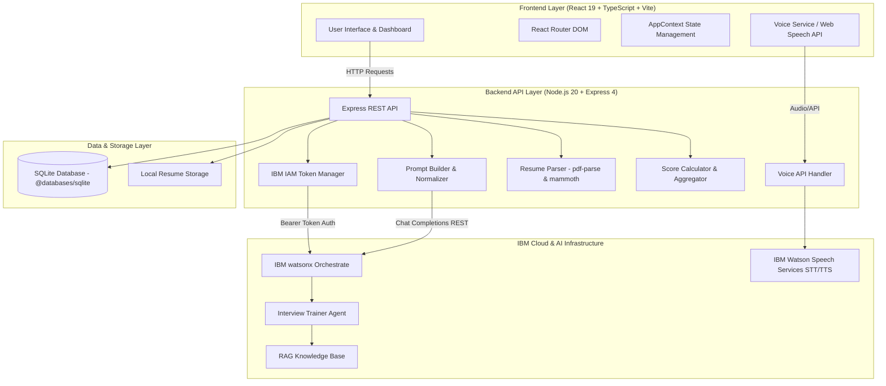

---

## 🛠️ Technology Stack

| Layer | Technology | Version | Purpose |
| :--- | :--- | :---: | :--- |
| **Frontend Framework** | React | `19.0.0` | Component-driven user interface |
| **Frontend Language** | TypeScript | `5.4.2` | Static type safety and structured models |
| **Build Tool** | Vite | `8.2.2` | Development server and production bundler |
| **Styling** | Tailwind CSS | `4.3.3` | Modern styling with Dark/Light theme design tokens |
| **Routing** | React Router DOM | `7.18.3` | Declarative client-side routing |
| **Icons & Alerts** | Lucide React / react-hot-toast | `1.41.0` / `2.6.0` | Modern SVG icons and non-blocking toast notifications |
| **Backend Runtime** | Node.js | `20.x` | Asynchronous JavaScript/TypeScript runtime |
| **Backend Framework** | Express | `4.18.3` | RESTful API routing, controllers, and middleware |
| **Database** | SQLite (`@databases/sqlite`) | `4.0.2` | Embedded relational database for profiles, sessions, and evaluations |
| **Document Parsing** | `pdf-parse` / `mammoth` | `1.1.1` / `1.7.2` | Text and keyword extraction from PDF and Word documents |
| **File Handling** | `multer` | `1.4.5` | Multipart form-data handling for resume uploads |
| **AI Orchestration** | IBM watsonx Orchestrate | `v2.0` | Agent orchestration layer for questions, evaluation, and coaching |
| **Knowledge Grounding** | RAG Knowledge Base | — | Interview domain and role-specific preparation material |
| **Cloud Platform** | IBM Cloud | — | Cloud infrastructure hosting the AI service |
| **Voice Services** | IBM Watson Speech / Web Speech | REST / Native | Speech-to-Text (STT) and Text-to-Speech (TTS) with browser fallback |
| **Development Workflow** | IBM Bob | — | AI-assisted development environment and workflow |
| **Automated Testing** | Jest / `ts-jest` | `29.7.0` | Comprehensive unit testing across parsers, calculators, and services |

---

## 🎯 Features

- **Personalized Interview Preparation:** Configures interview sessions tailored to target job titles, candidate skill sets, experience levels, and target companies.
- **Resume-Aware Practice:** Extracts text from uploaded PDF/DOCX resumes to formulate relevant questions based on actual candidate project and work history.
- **Technical Interview Mode:** Evaluates programming fundamentals, algorithms, system design, databases, and framework internals.
- **HR & Cultural Fit Mode:** Assesses career goals, workplace adaptability, cultural alignment, and communication style.
- **Behavioral Interview Mode (STAR):** Tests real-world situational judgment using the Situation, Task, Action, and Result methodology.
- **Mixed Interview Simulation:** Combines Technical (60%), HR (20%), and Behavioral (20%) questions to simulate a complete interview loop.
- **Difficulty Selection:** Choose between Easy, Medium, Hard, and Adaptive difficulty levels.
- **One-Question-at-a-Time Mock Interviews:** Interactive workspace presenting questions sequentially with timers and response inputs.
- **AI Answer Evaluation:** Instant feedback after each answer submission.
- **Multi-Dimensional Scoring:** Evaluates candidate answers across five distinct competency dimensions.
- **Strengths & Weaknesses Analysis:** Highlights demonstrated positives alongside actionable growth areas.
- **Improvement Recommendations:** Provides specific guidance on how to strengthen answers for future interviews.
- **Model Answer Guidance:** Offers access to expert reference answers and key talking points.
- **Final Interview Report:** Aggregates session performance, category averages, readiness verdicts, and exportable summaries.
- **Interview History Tracking:** Archives past interview sessions for progress monitoring.
- **AI Coaching Assistant:** Dedicated conversational chat interface for ad-hoc interview advice and technical drills.
- **Voice Interview Mode:** Hands-free voice interview experience with speech transcription and voice playback.

---

## 🔄 How the AI Interview Workflow Works

```mermaid
flowchart LR
    A[1. Candidate Profile] --> B[2. Resume Upload]
    B --> C[3. Interview Setup]
    C --> D[4. Backend Dispatch]
    D --> E[5. watsonx Orchestrate Agent]
    E --> F[6. RAG Knowledge Retrieval]
    F --> G[7. Question Display]
    G --> H[8. Candidate Answer]
    H --> I[9. Agent Evaluation]
    I --> J[10. Score & Feedback]
    J --> K[11. Session Report]
```

1. **Candidate Profile Creation:** The candidate enters their name, target job role, experience level, and key skills.
2. **Resume Ingestion (Optional):** The candidate uploads a resume (`.pdf` or `.docx`); text and skills are parsed to enhance question context.
3. **Session Calibration:** The candidate selects interview domain (Technical, HR, Behavioral, Mixed), difficulty, and question count (5, 10, or 15).
4. **Backend Request:** The application backend packages candidate parameters and session configuration.
5. **Agent Orchestration:** The backend prompts the Interview Trainer Agent configured in IBM watsonx Orchestrate.
6. **RAG Knowledge Retrieval:** The agent retrieves relevant role context, technical standards, or behavioral rubrics from the RAG knowledge base.
7. **Question Presentation:** The candidate receives the tailored interview question in the interactive workspace.
8. **Answer Submission:** The candidate responds via text entry or speech input.
9. **Automated Evaluation:** The agent evaluates the response against the standardized 5-dimension rubric.
10. **Feedback Display:** The candidate reviews competency scores, strengths, weaknesses, and optional model answers.
11. **Performance Report:** Upon completing all questions, the system computes category averages, overall scores, and an executive session report.

---

## 📊 Answer Evaluation & Scoring Rubric

Candidate answers are assessed across **five standardized dimensions** on a `0.0` to `10.0` scale:

| Scoring Dimension | Evaluation Focus | Weight |
| :--- | :--- | :---: |
| **Technical Accuracy** | Correctness of technical concepts, algorithms, syntax, architecture, and domain knowledge. | **30%** |
| **Relevance** | Direct alignment with the question prompt without off-topic filler or evasion. | **25%** |
| **Clarity** | Structured communication, logical organization, concise phrasing, and clear terminology. | **20%** |
| **Completeness** | Thorough coverage of edge cases, trade-offs, practical examples, and results. | **15%** |
| **Communication** | Professional delivery, articulate tone, and stakeholder awareness. | **10%** |

### Feedback Output Structure
- **Competency Ratings:** Numeric scores (0–10) for each individual dimension.
- **Overall Weighted Score:** Aggregated session rating based on rubric weightings.
- **Demonstrated Strengths:** Specific positive elements and well-explained concepts in the candidate's answer.
- **Key Growth Areas:** Constructive feedback detailing missing depth, structural gaps, or inaccuracies.
- **Actionable Recommendations:** Strategic tips and study suggestions tailored to the candidate's target role.
- **Reference Model Answer:** Complete expert answer with key talking points to illustrate ideal responses.

---

## 🎙️ Voice Interview

The platform includes a dedicated **Voice Interview** mode for hands-free spoken practice:

- **Speech Recognition (STT):** Transcribes candidate spoken responses in real time.
- **Text-to-Speech (TTS):** Synthesizes interview questions and feedback into clear spoken audio.
- **Dual-Tier Voice Architecture:**
  1. **IBM Watson Speech Services:** Server-side high-fidelity Speech to Text and Text to Speech processing when configured.
  2. **Browser Web Speech API:** Automatic client-side fallback ensuring voice functionality remains accessible in any modern browser without mandatory cloud voice credentials.

---

## 🎬 Video Demo

Watch the real-time AI Interview Trainer conversational flow and answer evaluation:

<p align="center">
  <a href="docs/videos/chat-response.mp4">
    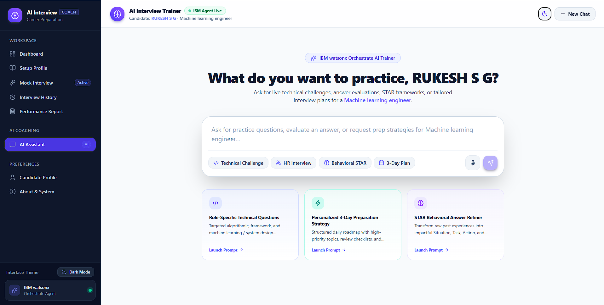
  </a>
</p>

> 🎥 **[Click here to watch the full Chat & Interview Evaluation Video Demo](docs/videos/chat-response.mp4)** *(MP4 format)*

---

## 🖼️ Application Walkthrough

<div align="center">

### 1. Landing Page
*Modern landing experience presenting platform capabilities, interview pathways, and quick-start actions.*
<p align="center">
  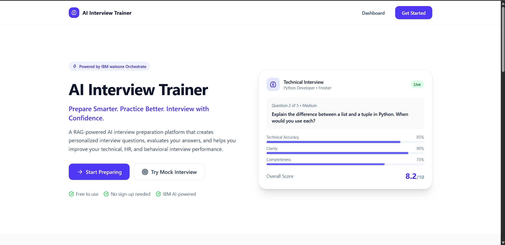
</p>

<br/>

### 2. Candidate Dashboard
*Central dashboard displaying performance metrics, completed sessions, average scores, and skill competencies.*
<p align="center">
  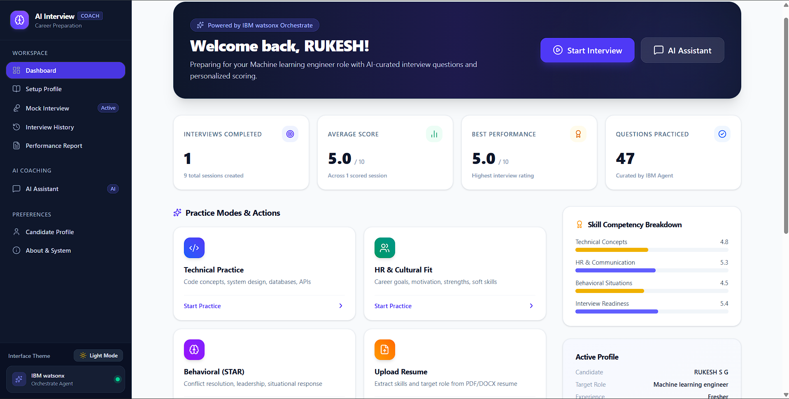
</p>

<br/>

### 3. Candidate Profile Setup
*Candidate identity hub with target role selection, experience level calibration, and custom skill tagging.*
<p align="center">
  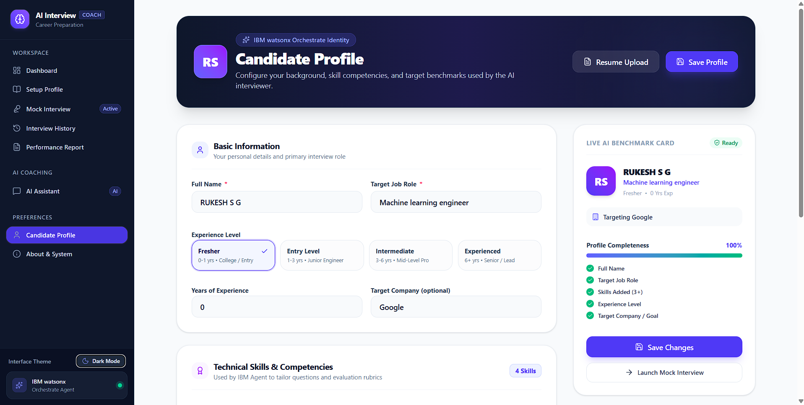
</p>

<br/>

### 4. Resume Upload & Skill Extraction
*Resume ingestion supporting PDF and DOCX formats with automatic text parsing and profile synchronization.*
<p align="center">
  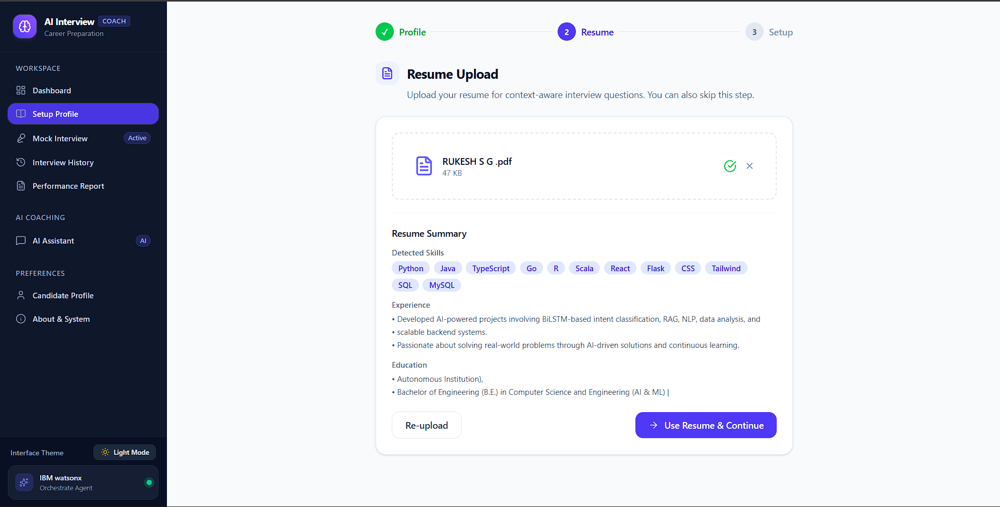
</p>

<br/>

### 5. Interview Calibration & Setup
*Setup matrix for configuring interview domain, difficulty level, question volume, and delivery mode.*
<p align="center">
  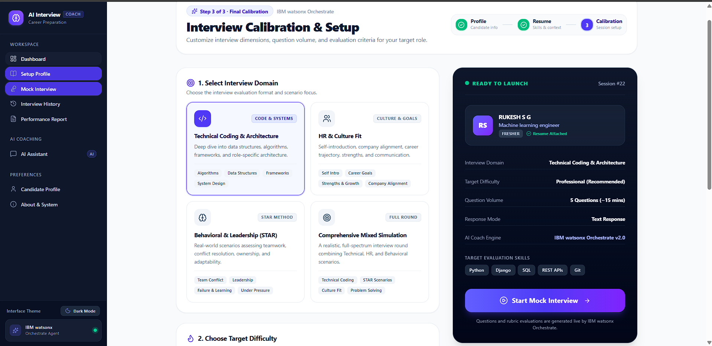
</p>

<br/>

### 6. Mock Interview Workspace
*Distraction-free interview workspace with sequential question delivery, timer, answer input, and live feedback.*
<p align="center">
  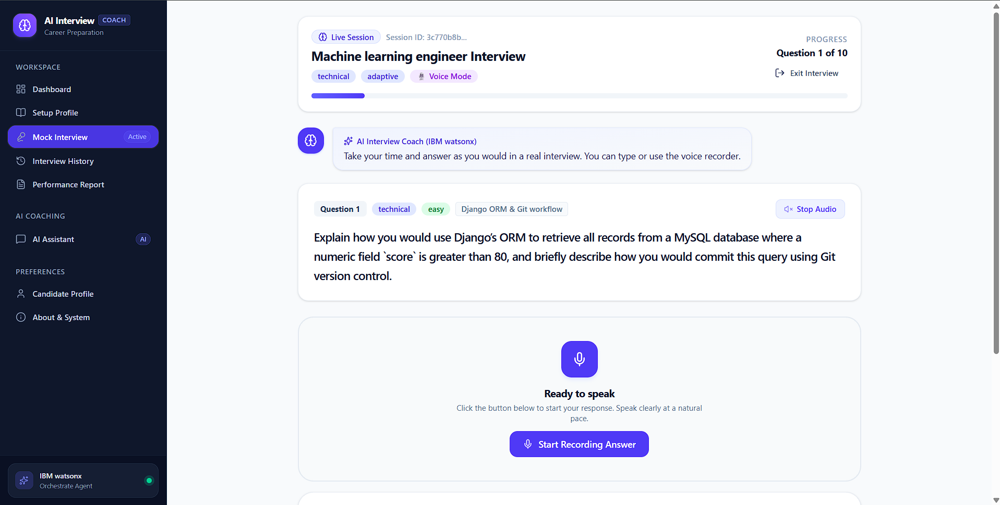
</p>

<br/>

### 7. AI Coaching Assistant
*Dedicated conversational coach powered by IBM watsonx Orchestrate with support for markdown tables, syntax-highlighted code blocks, and copy actions.*
<p align="center">
  
</p>

<br/>

### 8. Comprehensive Performance Report
*Detailed evaluation dossier with readiness verdicts, competency breakdowns, strengths, growth areas, and full question audits.*
<p align="center">
  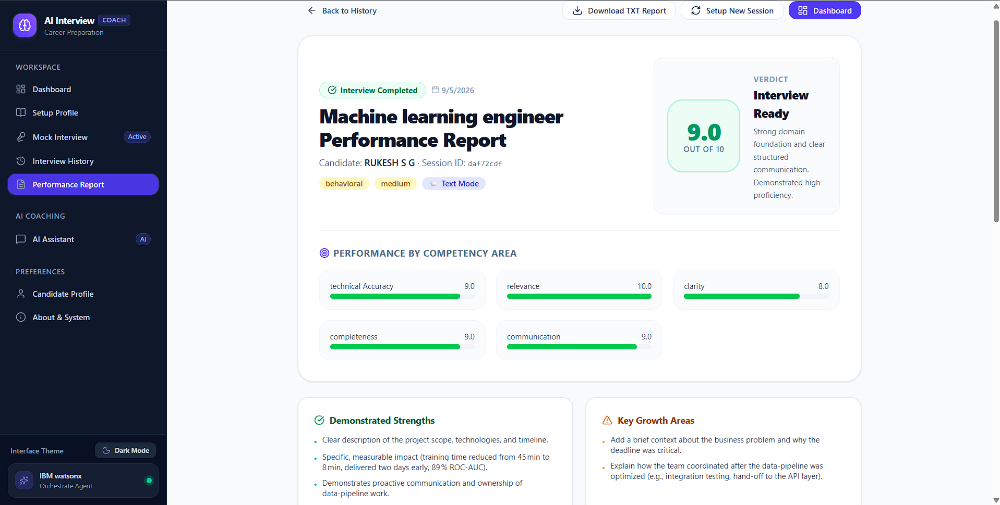
</p>

<br/>

### 9. Interview History & Tracking
*Persistent archive of completed sessions with score indicators, date filters, and instant report access.*
<p align="center">
  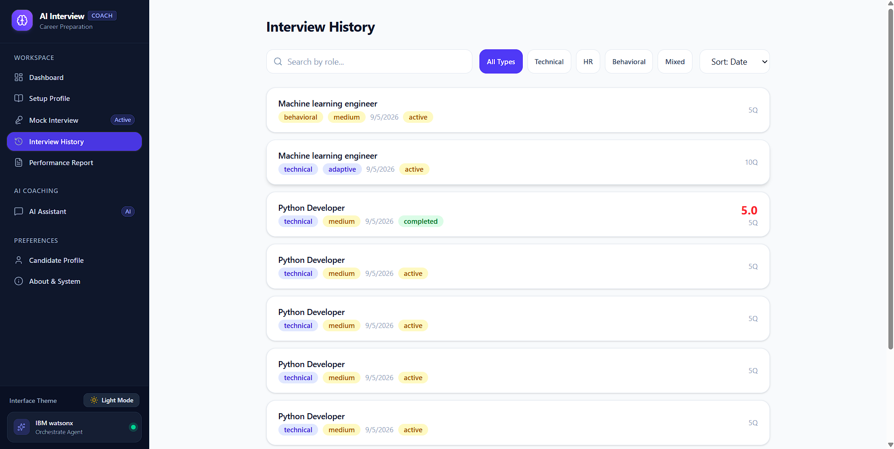
</p>

</div>

---

## 📡 REST API Reference

### Health & System
- `GET /api/health` — Returns backend health status, SQLite database connectivity, and agent service reachability.
- `GET /api/voice/status` — Returns voice service availability and active provider status.

### Candidate Profile
- `GET /api/profile` — Retrieves the active candidate profile.
- `POST /api/profile` — Creates or updates candidate details, target role, skills, and target company.

### Resume Processing
- `POST /api/resume/upload` — Uploads a `.pdf` or `.docx` resume and extracts text, experience, and skill tags.

### Mock Interview Lifecycle
- `POST /api/interview/start` — Initializes a new interview session with specified domain, difficulty, and question count.
- `POST /api/interview/question` — Generates the next sequential question via the IBM watsonx Orchestrate agent.
- `POST /api/interview/evaluate` — Evaluates candidate answer across 5 rubrics and calculates scores.
- `POST /api/interview/model-answer` — Retrieves reference model answer and key points for a question.
- `POST /api/interview/summary` — Finalizes the interview session and generates aggregate category summaries.
- `GET /api/interviews` — Lists all previous interview sessions.
- `GET /api/interviews/:id` — Retrieves complete session record with questions, answers, and evaluations.

### AI Assistant
- `POST /api/chat` — Dispatches conversational coaching queries to the Interview Trainer Agent.

---

## 🚀 Getting Started & Local Setup

### Prerequisites
- **Node.js** `v18.0.0` or higher (`v20.x` LTS recommended)
- **npm** `v9.0.0` or higher
- **Git**

### 1. Clone the Repository
```bash
git clone https://github.com/rukeshsg/AI-Interview-Trainer.git
cd AI-Interview-Trainer
```

### 2. Install Dependencies
Install all workspace dependencies across root, backend, and frontend:
```bash
npm run install:all
```

### 3. Configure Environment Variables
Copy the environment template file:
```bash
cp .env.example .env
```

Configure `.env` with your settings (keep credentials local):
```ini
# Server Configuration
PORT=3001
NODE_ENV=development

# IBM watsonx Orchestrate Configuration
IBM_ORCHESTRATE_BASE_URL=https://jp-tok.watson-orchestrate.cloud.ibm.com
IBM_ORCHESTRATE_API_KEY=your_ibm_cloud_api_key_here
IBM_ORCHESTRATE_AGENT_ID=your_agent_id_here
IBM_ORCHESTRATE_CRN=your_service_instance_crn_here
IBM_ORCHESTRATE_DEPLOYMENT_PLATFORM=ibmcloud
IBM_ORCHESTRATE_ENVIRONMENT=live
IBM_ORCHESTRATE_AGENT_VERSION=v2.0

# Optional: IBM Watson Speech Services (STT / TTS)
IBM_STT_API_URL=
IBM_STT_API_KEY=
IBM_TTS_API_URL=
IBM_TTS_API_KEY=

# Set to true for offline development without active IBM Cloud credentials
ENABLE_MOCK_AI=false
```

### 4. Run Development Servers
Start both backend and frontend applications concurrently:
```bash
npm run dev
```

- **Frontend Application:** [http://localhost:5173](http://localhost:5173)
- **Backend API Server:** [http://localhost:3001](http://localhost:3001)
- **Health Check Endpoint:** [http://localhost:3001/api/health](http://localhost:3001/api/health)

---

## 🧪 Testing & Verification

The repository includes automated unit and integration tests verifying parser adapters, prompt builders, validation middleware, and scoring engines:

```bash
npm test --prefix backend
```

### Verified Test Results
```
PASS tests/resumeParser.test.ts
PASS tests/orchestrate.test.ts
PASS tests/responseParser.test.ts
PASS tests/voice.test.ts
PASS tests/scoreCalculator.test.ts
PASS tests/validation.test.ts

Test Suites: 6 passed, 6 total
Tests:       32 passed, 32 total
Snapshots:   0 total
Time:        2.87 s
```

### Production Build Validation
```bash
npm run build --prefix backend
npm run build --prefix frontend
```
Both backend and frontend compile with zero errors.

---

## 📂 Repository Structure

```text
AI-Interview-Trainer/
├── backend/                        # Node.js + Express + TypeScript API Server
│   ├── src/
│   │   ├── db/                     # SQLite initialization and DAO repositories
│   │   │   ├── database.ts         # SQLite connection manager
│   │   │   ├── schema.ts           # DDL table schemas
│   │   │   └── repositories/       # Profile, session, question, evaluation DAOs
│   │   ├── middleware/             # Error handling, validation, multer upload
│   │   ├── parsers/                # PDF and DOCX resume text extraction
│   │   ├── routes/                 # Express route controllers (interview, profile, chat)
│   │   ├── services/               # IBM watsonx Orchestrate & Speech service adapters
│   │   ├── types/                  # Shared TypeScript interfaces
│   │   └── utils/                  # Prompt builder, score calculator, logger
│   ├── tests/                      # Jest unit test suites (32 tests passing)
│   ├── tsconfig.json
│   └── package.json
├── frontend/                       # React 19 + TypeScript + Vite SPA
│   ├── src/
│   │   ├── api/                    # Axios REST client bindings
│   │   ├── components/             # UI component library (Buttons, Cards, Badges)
│   │   │   └── ui/                 # MarkdownRenderer, FormControls, Feedback
│   │   ├── context/                # AppContext (Profile, Theme, Session state)
│   │   ├── layouts/                # AppLayout, Sidebar, Navbar
│   │   ├── pages/                  # Route views (Landing, Dashboard, Setup, Mock, Report...)
│   │   ├── services/               # Voice service (IBM TTS/STT + Web Speech fallback)
│   │   └── types/                  # Frontend TypeScript type declarations
│   ├── index.html
│   ├── vite.config.ts
│   └── package.json
├── docs/                           # Documentation and media assets
│   ├── screenshots/                # 9 curated application walkthrough screenshots
│   └── videos/                     # Chat and live demo video recordings
├── .env.example                    # Environment variable template
├── .gitignore                      # Git ignore rules for node, data, env, build
├── package.json                    # Workspace runner scripts (concurrently)
└── README.md                       # Comprehensive project documentation
```

---

## 🔐 Environment Variables & Security

All sensitive credentials—including IBM Cloud IAM API keys, service instance identifiers, and optional Speech API keys—must remain in your local `.env` file and **must never be committed to source control**.

- The repository includes a `.gitignore` preconfigured to exclude `.env`, `data/*.db`, uploaded files in `uploads/`, and build artifacts.
- The repository `.env.example` file contains only placeholder keys.

---

## 🏛️ Development Context

This project was developed as part of the **IBM SkillsBuild / AICTE Internship in Artificial Intelligence** project track:

- **IBM Bob** was used as the primary AI-assisted development environment and workflow.
- **IBM watsonx Orchestrate** provides the AI agent and orchestration layer used by the application for question generation, evaluation, and coaching.
- **IBM Cloud** provides the cloud platform infrastructure hosting the watsonx Orchestrate services.

---

## 📋 Project Status

**Status:** Completed

- **Problem Statement:** Problem Statement No. 22 — *Interview Trainer Agent*
- **Program:** IBM SkillsBuild / AICTE Internship in Artificial Intelligence
- **Architecture:** Full-stack web application with IBM watsonx Orchestrate agent integration, RAG knowledge base grounding, and automated evaluation.

> *Disclaimer: This application is an independent educational and portfolio project implementation. It is not an official IBM product and is not endorsed by IBM.*

---

## 🔗 Live Application & Repository Links

- **Live Frontend (Vercel):** [https://ai-interview-trainer-eight.vercel.app/](https://ai-interview-trainer-eight.vercel.app/)
- **Live Backend API (Render):** [https://ai-interview-trainer-backend-5s3m.onrender.com](https://ai-interview-trainer-backend-5s3m.onrender.com)
- **API Health Check Endpoint:** [https://ai-interview-trainer-backend-5s3m.onrender.com/api/health](https://ai-interview-trainer-backend-5s3m.onrender.com/api/health)
- **GitHub Repository:** [https://github.com/rukeshsg/AI-Interview-Trainer](https://github.com/rukeshsg/AI-Interview-Trainer)
- **Recommended GitHub Topics:** `ai`, `artificial-intelligence`, `interview-preparation`, `rag`, `ibm`, `ibm-watsonx`, `watsonx-orchestrate`, `ibm-cloud`, `react`, `typescript`
- **Demo Video:** [docs/videos/chat-response.mp4](docs/videos/chat-response.mp4)

---

<div align="center">
  <sub>AI Interview Trainer — Personalized Interview Preparation powered by IBM watsonx Orchestrate.</sub>
</div>
